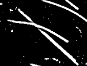
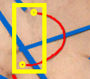
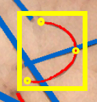
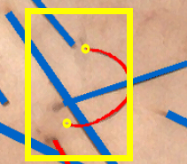
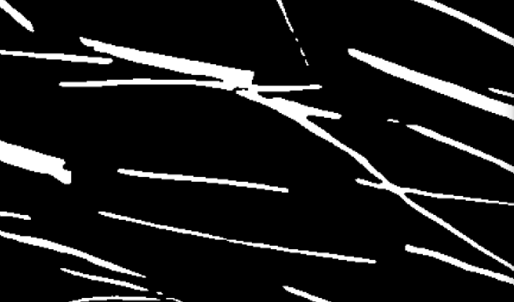
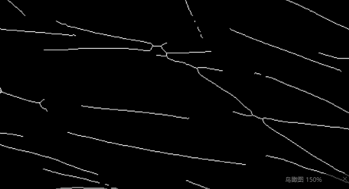
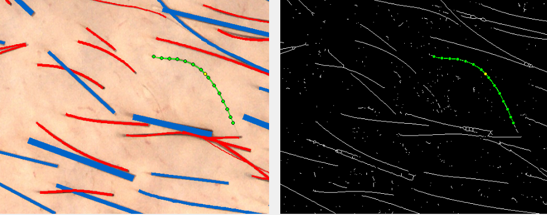

### 最短路径目前的几个问题

- 连通域断裂

  如下图：

​	用局部自适应法生成二值图时，毛发交叉处经常会出现不连通的情况。而一根毛发只要中间有一点点断裂，最短路径法就会失效。

​	**要求生成二值图时，要尽可能地消除毛发断裂（比如用图像闭运算去填补空洞、断裂）**

- 输入的ROI大小

  **（暂时不考虑，留着让用户手标）**

  为了减小计算量，目前是将**以两个点为对角线的矩形横纵各外扩30像素**作为ROI区域，进行最短路径的查找。但对于一些很弯曲的毛发，仅用**首尾两点**生成的ROI是无法将整根毛发囊括进去的。

  如下图所示：

  

  

  可能有两种解决方案：

  1. 要求用户在毛发中间、最边缘处多点一个点，以此来形成ROI区域。

     如下图所示：

     

  2. 在首尾两点的基础上，扩充更多像素（比如从30像素改为100像素）

     如下图所示：

     

- 运算效率**（代超已解决）**

  1. 先生成二值图的骨架，再计算最小路径（大大减少图节点的数目，但缺陷在于毛发交叉处骨架可能是变形的）

  

  ​	

  ​	

  

  在骨架图基础上算最小路径，运行速度会快许多倍。

  有些情况下骨架会变形。

  

  

- 自动识别端点后，通过最小路径来两两匹配的一个思路：

​	对于两个点，最小路径函数可以按顺序生成一系列点，依次得到一连串角度。用某种指标来表示角度的平滑度，平滑度最高且满足阈值的视为匹配成功

### 层次聚类的问题

- 大图爆内存

  Unable to allocate 100. TiB for an array with shape (13743892725760,)

## 二值化

## 端点检测

输出：一张图，一堆孤立点

## 骨架提取（端点配对）

两两配对后得到骨架

输出：骨架

## 宽度估计

对骨架各自测宽

1. 中点处矩形测宽

2. 小球跑血管

3. 

# 0.3版 全自动整合

